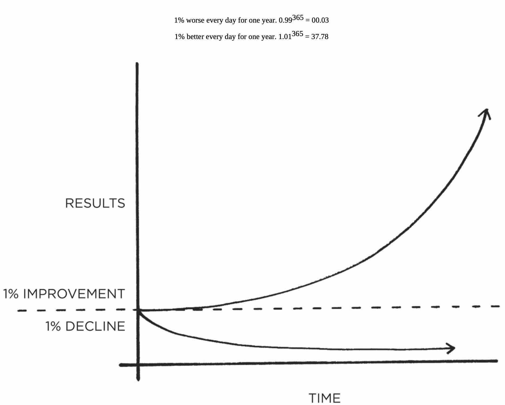
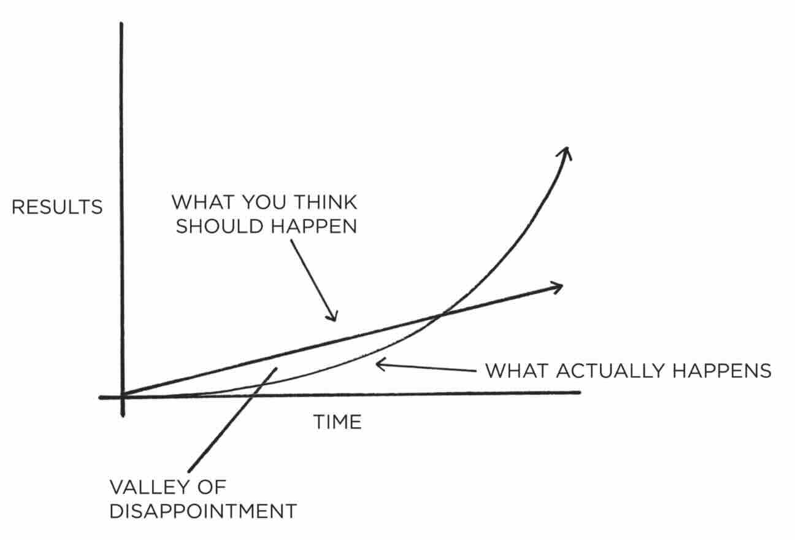

In his book "Atomic Habits", James Clear outlines the principles of habit formation and behavior change. The author shares his personal journey of recovery from a severe injury, which led him to understand that significant progress stems from a series of small, consistent actions, rather than singular transformative events. Clear introduces the "Four Laws of Behavior Change": making habits obvious, attractive, easy, and satisfying. He emphasizes the importance of systems over goals, highlighting how environmental design, social influence, and the immediate gratification of rewards play crucial roles in establishing and maintaining habits, ultimately arguing that true identity change is the North Star of habit transformation.

<!-- truncate -->

### Summery:

The central theme revolves around the idea that "success is the product of daily habits—not once-in-a-lifetime transformations". It emphasizes the compounding effects of small, consistent improvements and the importance of systemic thinking over goal-setting.

### I. The Power of "Atomic Habits": Compounding Small Improvements

The fundamental premise of "Atomic Habits" is that minuscule, consistent changes, referred to as "atomic habits," accumulate over time to produce significant, even "remarkable," results.
*   **Compound Interest of Self-Improvement**: Habits are likened to "the compound interest of self-improvement". Just as money multiplies with compound interest, "the effects of your habits multiply as you repeat them".
*   **The 1% Rule**: Getting "just 1 percent better each day, you’ll end up with results that are nearly 37 times better after one year". Conversely, being 1% worse leads to a near-zero outcome (0.99^365 = 0.03). This small difference "can make over time is astounding".

*   **Delayed Outcomes**: The impact of small habits is often not immediately apparent. "It is only when looking back two, five, or perhaps ten years later that the value of good habits and the cost of bad ones becomes strikingly apparent". This requires patience, as "Change can take years—before it happens all at once," echoing the stonecutter analogy: "Yet at the hundred and first blow it will split in two, and I know it was not that last blow that did it—but all that had gone before". This period of unnoticeable progress before breakthroughs is called the "Plateau of Latent Potential". People often stop making changes because they don't see immediate tangible results, not realizing their work is being stored.
*   **Trajectory Over Current Results**: What truly matters is the "current trajectory" set by your habits, rather than "current results". Your "outcomes are a lagging measure of your habits". For example, your net worth is a lagging measure of your financial habits, and your weight is a lagging measure of your eating habits. Tiny daily choices "will compound ten or twenty years down the line". Good habits make time your ally, while bad habits make time your enemy.
*   **Double-Edged Sword**: Habits are a "double-edged sword". They can either compound for you or against you. For instance, productivity and knowledge compound positively, as does being nicer in interactions leading to stronger relationships. Conversely, stress and negative thoughts can compound into serious issues.
*   **Atomic Habit Defined**: An "atomic habit" refers to a tiny change, a marginal gain, or a 1 percent improvement, and they are "little habits that are part of a larger system". Just as atoms are the building blocks of molecules, "atomic habits are the building blocks of remarkable results". They are small and easy to do, yet also "the source of incredible power".

## II. Systems Over Goals: The Foundation for Lasting Change

A pivotal concept introduced is the distinction between goals and systems, advocating for a focus on the latter for sustained progress.
*   **Goals vs. Systems**: "Goals are about the results you want to achieve. Systems are about the processes that lead to those results". The author argues that focusing solely on goals often leads to failure because the underlying "system" for change is flawed.
*   **Falling to the Level of Your Systems**: "You do not rise to the level of your goals. You fall to the level of your systems". This highlights that consistent behavior is a direct output of the established processes, not merely aspirations.
*   **Goal-less Thinking**: True long-term thinking is described as "goal-less thinking". It's about **"the cycle of endless refinement and continuous improvement,"** and **"your commitment to the process that will determine your progress"**.

## III. Identity-Based Habits: Changing Who You Are

Beyond merely changing behaviors, "Atomic Habits" emphasizes that **true, lasting habit change stems from a shift in identity**.
*   **Behavior Change as Identity Change**: "True behavior change is identity change". Instead of focusing on what you want to achieve (outcome-based goals) or what you need to do (process-based habits), the most profound change comes from focusing on **"who you wish to become"**.
*   **"Repeated Beingness"**: Your identity is literally your "repeated beingness," formed by the actions you consistently take. Every action is a **"vote for the type of person you wish to become"**.
*   **Proof Through Small Wins**: To build a new identity, one must "Prove it to yourself with small wins". For instance, "Each time you write a page, you are a writer. Each time you practice the violin, you are a musician".
*   **Pride and Motivation**: "The more pride you have in a particular aspect of your identity, the more motivated you will be to maintain the habits associated with it". The example of Clark stopping nail-biting after taking pride in his manicured nails illustrates this point.

## IV. The Four Laws of Behavior Change

The author presents **four fundamental laws for building good habits and breaking bad ones**. These laws offer a framework for designing an environment conducive to desired behaviors.

### 1. Make it Obvious (1st Law):
*   **Awareness is Key**: Habits are often "nonconscious and automatic". To improve them, you must first become aware of them. "Until you make the unconscious conscious, it will direct your life and you will call it fate".
*   **The Habits Scorecard**: A practical tool to identify and categorize existing habits (+ for good, – for bad, = for neutral) by listing daily behaviors and assessing their long-term impact. The goal is to **"simply notice what is actually going on" without judgment**.
*   **Implementation Intentions**: Clearly defining *when* and *where* a habit will occur: **"I will [BEHAVIOR] at [TIME] in [LOCATION]"**. This specificity helps in saying "no to things that derail progress".
*   **Habit Stacking**: Linking a new habit to an existing one: **"After [CURRENT HABIT], I will [NEW HABIT]"**. This leverages established routines as cues.
*   **Environmental Design**: Make cues for good habits visible and accessible (e.g., placing workout clothes out). Conversely, make cues for bad habits invisible (e.g., removing junk food from sight). "We like to think that we are in control... but the truth... is that many of the actions we take each day are shaped... by the most obvious option".
*   **Priming the Environment**: "Resetting the room" (e.g., cleaning up after an activity) prepares the environment for the next desired action, making it easy to start.

### 2. Make it Attractive (2nd Law):
*   **Dopamine-Driven Feedback Loop**: Habits are deeply tied to dopamine, a neurotransmitter associated with craving and desire. "When dopamine rises, so does our motivation to act". It's the **"anticipation of a reward—not the fulfillment of it—that gets us to take action"**.
*   **Supernormal Stimuli**: Humans are naturally drawn to "heightened versions of reality" (like hyper-palatable processed foods) that amplify desire.
*   **Temptation Bundling**: Pair an action you *need* to do with an action you *want* to do. Formula: **"After [HABIT I NEED], I will [HABIT I WANT]"** (e.g., Ronan Byrne connecting Netflix to his stationary bike).
*   **Social Influence**: We are heavily influenced by the habits of those around us, especially "the close, the many, and the powerful". "One of the most effective things you can do to build better habits is to join a culture where your desired behavior is the normal behavior".
*   **Reframing**: Change your mindset about habits by highlighting their benefits or reframing negative associations. "You don’t 'have' to. You 'get' to" (e.g., "I get to run in the morning" instead of "I have to run"). This relates to the inverse: "make it unattractive" (e.g., Allen Carr's reframing of smoking).
*   **Underlying Motives**: Cravings are specific manifestations of deeper, underlying human motives (e.g., to conserve energy, obtain food, connect with others, reduce uncertainty, gain status). Understanding these deeper desires can help in making habits attractive.

### 3. Make it Easy (3rd Law):
*   **Reduce Friction**: Make good habits effortless and bad habits difficult. "The greater the friction, the less likely the habit".
*   **The Law of Least Effort**: Human nature seeks the path of least resistance. Design your environment to make desired actions the easiest option.
*   **"Master the Habit of Showing Up"**: Don't focus on perfecting a habit from the start; instead, "do the easy thing on a more consistent basis". "A habit must be established before it can be improved".
*   **The Two-Minute Rule**: **"When you start a new habit, it should take less than two minutes to do"**. This minimizes the initial barrier to action, ensuring you "master the habit of showing up".
*   **Commitment Devices**: Make choices in the present that control your future actions, binding you to good habits and restricting bad ones (e.g., Victor Hugo locking away his clothes to write, Nir Eyal's internet router timer). These devices "enable you to take advantage of good intentions before you can fall victim to temptation".

### 4. Make it Satisfying (4th Law):
*   **Immediate Gratification**: The brain prioritizes immediate pleasure. Behaviors followed by "feelings of pleasure" are signals to the brain to "Do this again, next time".
*   **The Cardinal Rule of Behavior Change**: **"What is rewarded is repeated. What is punished is avoided"**.
*   **Instant vs. Delayed Rewards**: Many good habits have delayed rewards, while bad habits often provide instant gratification. This is known as "time inconsistency" or "hyperbolic discounting". "The more immediate pleasure you get from an action, the more strongly you should question whether it aligns with your long-term goals".
*   **Habit Tracking**: A simple way to make the progress of good habits visible and satisfying. Tools like the "Paper Clip Strategy" or crossing off a calendar day provide immediate visual proof of progress, creating a "habit streak" that motivates continued action.
*   **Never Miss Twice**: The critical rule for maintaining streaks: **"If I miss one day, I try to get back into it as quickly as possible. Missing once is an accident. Missing twice is the start of a new habit"**.
*   **Habit Contracts**: Formal agreements with accountability partners that outline a commitment to a habit and specify punishments for non-adherence, leveraging the desire for social approval and avoiding negative consequences.

## V. Additional Insights
*   **Genetic Predisposition**: Genes influence nearly "every behavior". While they don't dictate destiny, they "predispose you to a unique cluster of genetic traits" that can make certain habits naturally easier or harder. The goal is to "identify the opportunities and habits that are right for you" based on your personality.
*   **The Plateau of Latent Potential**: There's often a period of unnoticeable progress before breakthroughs occur. Patience is crucial to overcome this "Valley of Disappointment".

*   **The Role of Emotion and Desire**: "Desire is the difference between where you are now and where you want to be in the future". Conversely, "Happiness is simply the absence of desire... It arrives when you have no urge to feel differently". This suggests that observing actions without craving a change in state leads to contentment.
*   **Brain Plasticity**: Repetition of habits leads to "clear physical changes in the brain," akin to muscles adapting to training. **"Neurons that fire together wire together"**.

### Highlights

- ➕ Small Habits Compound  
A 1% improvement every day leads to 37x improvement in a year.
Bad habits compound negatively in the same way.

- 🛠️ Systems vs. Goals  
Don’t just set goals—build systems that get you there.
Winners and losers often have the same goals. Systems make the difference.

- 🧩 Identity-Based Habits  
Focus on who you want to become, not just what you want to achieve.
“The goal is not to read a book, but to become a reader.”
Every action is a vote for the kind of person you want to be.

- 🔁 Cue → Craving → Response → Reward  
This habit loop explains how behaviors are formed and maintained.

- ⚖️ Good vs. Bad Habit Loop  
Good habits: usually feel bad now but benefit long-term.
Bad habits: feel good now but harm long-term.
Key insight: align short-term satisfaction with long-term benefits.

- 🎯 Motivation ≠ Discipline  
It’s not about willpower. It's about environment and design.
People with strong self-control are better at avoiding temptation, not resisting it.

- 📈 Mastery through Deliberate Practice  
Combine automaticity (via habits) with intentional improvement.
Use reflection and review to maintain self-awareness and avoid complacency.

### Opinion

In essence, "Atomic Habits" provides a systematic framework for understanding and manipulating the forces that drive human behavior, enabling individuals to cultivate habits that align with their long-term aspirations by making them obvious, attractive, easy, and satisfying.

I really liked this book, read it multiple times.

### Conclusion

- Success = Systems + Tiny Improvements ✅
- I would recommend it to everyone 👍

<a href="#" class="go-to-top">Go to Top</a>