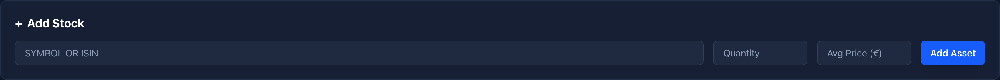
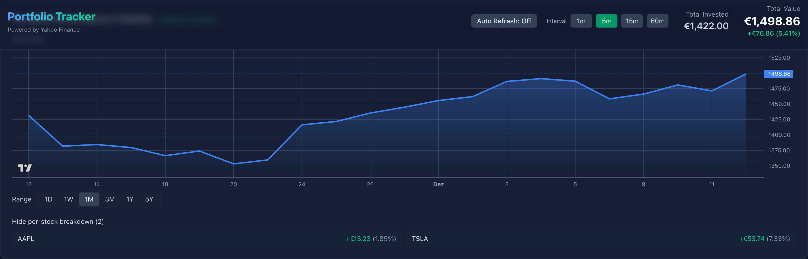
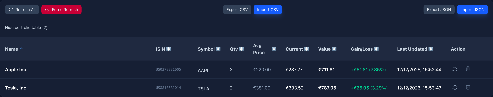
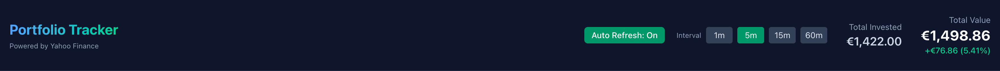

This post explains the design and implementation of a small browser-first [portfolio tracker](https://ammarnajjar.github.io/portfolio) I built. It focuses on requirements, the challenges I ran into, and how the final solution addresses them, including code snippets that illustrate the state handling, caching, and chart interaction.

<!-- truncate -->

## Goals and requirements

I collected these goals before coding:

- Privacy-first: keep user data local by default; no server-side storage unless the user opts in.
- Low network usage: avoid redundant requests; be friendly to metered or slow connections.
- Responsive UI: range selections and interactions should feel immediate, even when network calls are needed in the background.
- Robustness: accept imported or hand-edited JSON and avoid re-fetching data unnecessarily.
- Testable: core behaviors must have unit tests to prevent regressions.

<a href="#" class="go-to-top">Go to Top</a>

## Implementation challenges

Several practical issues emerged while building the app:

1. Range caching vs. freshness

	 - Problem: caching prevents redundant requests, but users expect recent short-term data to be fresh (e.g. 1 month view where today's price matters).

	 - Trade-offs explored:
		 - Always fetch 1M (fresh) but cache longer ranges — simpler for correctness, but noisy for users who import histories.
		 - Never fetch on range change (UI-only) — efficient but risks displaying stale data.

 	 - Solution chosen: cache all ranges explicitly, but store `1M` as a persisted fetched-range so imported data that already covers 1M won't cause a fetch; additionally keep a history-based check (earliest candle `<=` cutoff) to treat imported history as covering a range.

2. Hand-edited or unsorted history arrays

	 - Problem: imported JSON may contain history arrays that are not sorted or that start later than the cutoff; naive checks that look at `history[0]` can be wrong.

	 - Solution: compute the earliest timestamp across a history array (min) and compare normalized UTC dates to decide coverage.

3. Per-item state persistence and migrations

	 - Problem: changing what is persisted (e.g., switching from implicit 1M to explicit `fetchedRanges`) requires handling existing localStorage states.

	 - Solution: make persisted metadata explicit (write `1M` into `fetchedRanges` when appropriate) and optionally provide a migration/backfill path that populates `fetchedRanges` for existing users based on current `history`.

<a href="#" class="go-to-top">Go to Top</a>

## Add-stock form

The Add-stock form is a compact flow that lets users add a new symbol to their portfolio. It validates symbols client-side, shows recent quotes for confirmation, and writes the new item into the store. Newly added symbols are picked up by the auto-refresh loop after the first cycle.



_*The Add-stock Form with symbol validation*_

<a href="#" class="go-to-top">Go to Top</a>

## How state is organized

- The app stores the entire application state under a single root key in `localStorage` (via a small helper) to keep reads/writes simple and make export/import predictable.
- The store (`StoreProvider`) keeps the `portfolio` array in React state and writes it to `localStorage` on every change. Each `PortfolioItem` has fields like:

```ts
type PortfolioItem = {
	id: string;
	symbol: string;
	qty: number;
	avgPrice?: number;
	currentPrice?: number;
	history?: { time: string; value: number }[];
	fetchedRanges?: Range[]; // e.g. ['1D','1W','1M']
	lastUpdated?: string;
}
```

Key helpers:

1) `storage` helper (simple JSON wrapper around `localStorage`)

```ts
export const readState = () => {
	try { return JSON.parse(localStorage.getItem(ROOT_KEY) || '{}'); } catch (_) { return {}; }
};

export const set = (key: string, value: unknown) => {
	const s = readState(); s[key] = value; localStorage.setItem(ROOT_KEY, JSON.stringify(s));
};

export const get = (key: string, defaultValue?: any) => {
	const s = readState(); return s[key] === undefined ? defaultValue : s[key];
};
```

2) `StoreProvider` persistence and fetched-range writes

```ts
// persist portfolio whenever it changes
useEffect(() => { storage.set('portfolio', portfolio); }, [portfolio]);

// on successful fetch for an item:
setPortfolio(current => current.map(p => p.id === item.id ? ({
	...p,
	history: mergeHistories(p.history, history),
	lastUpdated: new Date().toISOString(),
	fetchedRanges: Array.from(new Set([...(p.fetchedRanges || []), fetchRange])),
}) : p));
```

`mergeHistories` is a small utility that merges two arrays of dated candles, preserving order and avoiding duplicates.

<a href="#" class="go-to-top">Go to Top</a>

## Chart interaction and fetch policy

When a user clicks a range button (e.g. `1D`, `1W`, `1M`), the UI should update immediately and decide whether a network refresh is needed. The decision algorithm in `handleRangeChange` is:



_*Interactive chart showing selected range and per-stock breakdown; this view updates when ranges change.*_

1. Update local `range` state and call `setSelectedRange` in the store so the global selection reflects the UI.
2. If the store's `refreshPortfolioRange` is available, check whether any `PortfolioItem` already has the `targetRange` recorded in `fetchedRanges`.
3. For `1M` additionally check whether the item's `history` earliest date is at-or-before the 1M cutoff (UTC-normalized); if yes treat it as covered.
4. If none of the items cover the range, call `refreshPortfolioRange(targetRange)` which will fetch missing history and update `fetchedRanges`.

```ts
const handleRangeChange = async (targetRange: Range) => {
	setRange(targetRange); setSelectedRange?.(targetRange);
	if (!refreshPortfolioRange) return;

	const anyHave = portfolio.some(p => {
		if (Array.isArray(p.fetchedRanges) && p.fetchedRanges.includes(targetRange)) return true;
		if (targetRange === '1M' && Array.isArray(p.history) && p.history.length > 0) {
			// compute earliest timestamp robustly
			const earliestTs = Math.min(...p.history.map(h => Date.parse(h.time + 'T00:00:00')));
			const cutoff = getRangeCutoff('1M');
			return Date.UTC(new Date(earliestTs).getFullYear(), new Date(earliestTs).getMonth(), new Date(earliestTs).getDate())
				<= Date.UTC(cutoff.getFullYear(), cutoff.getMonth(), cutoff.getDate());
		}
		return false;
	});

	if (!anyHave) await refreshPortfolioRange(targetRange);
}
```
<a href="#" class="go-to-top">Go to Top</a>

## Merge Histories

The function below ensures merging two history arrays yields a sorted array without duplicate date entries:

```ts
function mergeHistories(oldH?: Candle[], newH?: Candle[]): Candle[] {
	const map = new Map<string, number>();
	(oldH || []).forEach(c => map.set(c.time, c.value));
	(newH || []).forEach(c => map.set(c.time, c.value));
	return Array.from(map.entries()).map(([time, value]) => ({ time, value })).sort((a,b) => a.time.localeCompare(b.time));
}
```

The table view shows merged history rows (per-day candles) for each item. `mergeHistories` ensures rows are unique by date and sorted chronologically; this table is used both for exports and for quick manual inspection when users import JSON.



_*Merged history table used for export/import and quick inspection.*_


<a href="#" class="go-to-top">Go to Top</a>

## Auto-refresh and background updates

The app includes an optional auto-refresh feature that updates quotes and short-range history in the background. Goals for this feature were:

- Keep UI responsive: update data in the background without blocking user interactions.
- Minimize network usage: only fetch updates for ranges that are considered "fresh" (short ranges like `1D`/`1W`) or when items explicitly need a refresh.
- Avoid redundant requests: respect `fetchedRanges` and the history-based coverage check described earlier.



_*App header and controls — range buttons, add-stock and status indicators (responsive).*_

Design notes:

- A lightweight polling loop runs when the app has focus and the user has enabled auto-refresh. It calls a `refreshPortfolio()` function periodically (configurable interval, e.g. 60s).
- `refreshPortfolio()` fetches quotes for all items and optionally fetches short-range history (for example `1D`) only if the item does not already have a recent timestamp or if `fetchedRanges` does not include that range.
- The UI shows a subtle status indicator while background refreshes are in progress; individual components update when the store writes new data.

Simplified code snippet (store polling + guarded refresh):

```ts
// in StoreProvider
useEffect(() => {
	if (!autoRefreshEnabled) return;
	let cancelled = false;
	const tick = async () => {
		if (cancelled) return;
		try {
			await refreshPortfolio({ onlyShortRanges: true });
		} catch (e) { /* swallow non-fatal errors */ }
		if (!cancelled) setTimeout(tick, AUTO_REFRESH_INTERVAL_MS);
	};
	tick();
	return () => { cancelled = true; };
}, [autoRefreshEnabled]);

// refreshPortfolio guarded by fetchedRanges
export async function refreshPortfolio(opts?: { onlyShortRanges?: boolean }) {
	const rangesToRefresh = opts?.onlyShortRanges ? ['1D'] : ALL_RANGES;
	for (const p of portfolio) {
		for (const r of rangesToRefresh) {
			if (Array.isArray(p.fetchedRanges) && p.fetchedRanges.includes(r)) continue;
			await refreshStock(p.id, r);
		}
	}
}
```

Notes:

- The polling loop is intentionally conservative: it only requests short-range data by default to keep bandwidth low.
- `refreshStock` and `refreshPortfolio` append the fetched range to `fetchedRanges` so subsequent cycles skip already-covered ranges.
- Errors in background refreshes are logged and do not interrupt the UI; a user-facing error flow is only triggered for foreground actions initiated by the user.


<a href="#" class="go-to-top">Go to Top</a>

## Testing and verification

- The repo uses Vitest + Testing Library for unit tests. Important tests include verifying `importPortfolio` behavior, `refreshPortfolio` caching logic, and the updated `fetchedRanges` persistence for `1M`.

## How to run locally

```bash
git clone https://github.com/ammarnajjar/portfolio.git
cd portfolio
npm ci
npm run dev
```

<a href="#" class="go-to-top">Go to Top</a>
